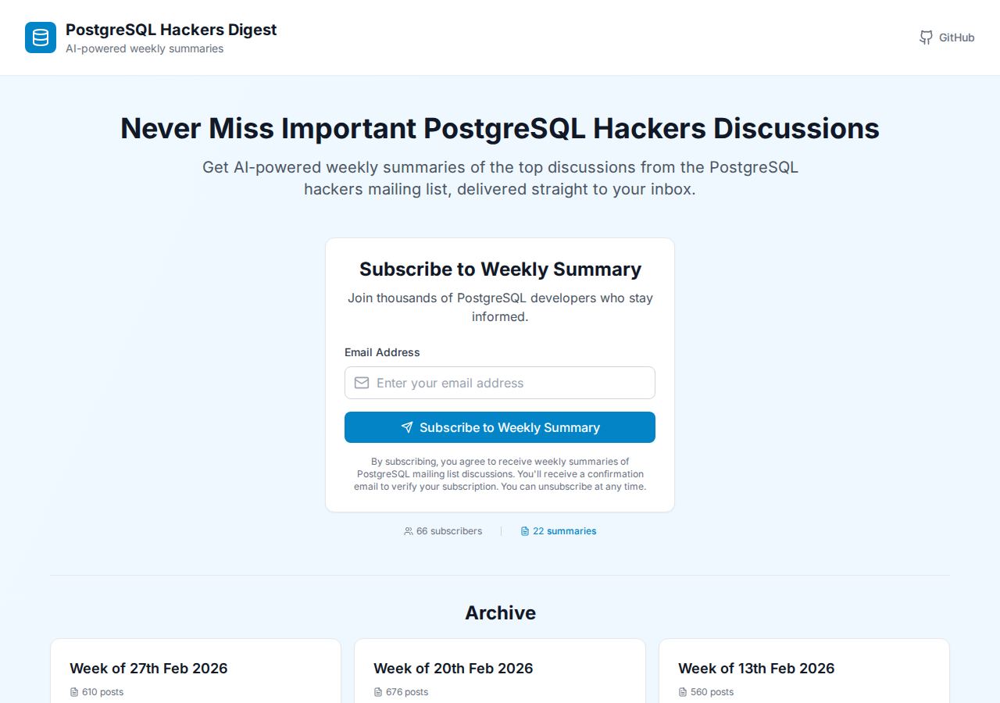
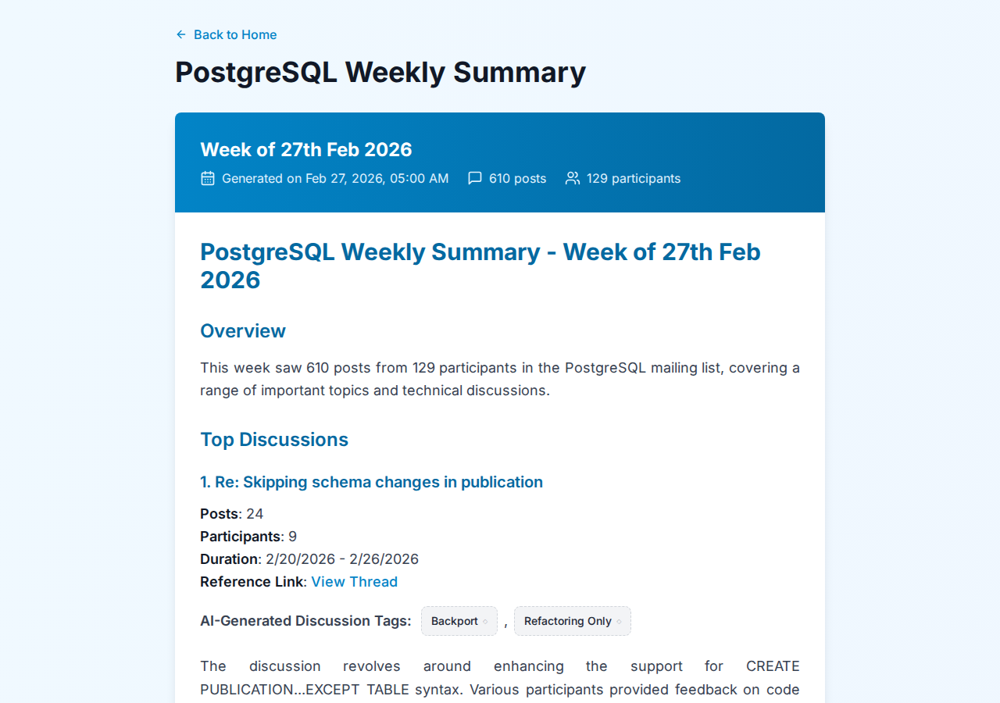

# PostgreSQL Hackers Digest

🌐 **[postgreshackersdigest.dev](https://www.postgreshackersdigest.dev)**

Weekly summaries of the PostgreSQL hackers mailing list, generated with AI and delivered to your inbox every Friday.

The pgsql-hackers list gets 500-700+ posts per week. Nobody has time to read all of that. This project scrapes the archives, summarizes the top discussions using OpenAI, tags them with commitfest categories, and emails subscribers a nicely formatted digest.



## How it works

Every week, a 4-step pipeline runs automatically via Supabase cron jobs:

1. **Fetch threads** — scrapes thread URLs from the PostgreSQL mailing list archives (last 7 days)
2. **Fetch content** — downloads the full email content for each thread
3. **Generate summary** — sends the content to OpenAI GPT-3.5-turbo, which picks the top discussions, summarizes them, and assigns tags
4. **Send emails** — delivers the summary to all confirmed subscribers via Resend

The whole thing runs serverless on Supabase Edge Functions. No servers to maintain.



## Tech stack

- **Frontend**: React + TypeScript + Tailwind CSS (Vite)
- **Backend**: Supabase (PostgreSQL + Edge Functions + Cron)
- **AI**: OpenAI GPT-3.5-turbo
- **Email**: Resend
- **Hosting**: Vercel
- **CI/CD**: GitHub Actions → Vercel (beta on `main`, production on `production` branch)

## Self-hosting

If you want to run your own instance:

1. Create a [Supabase](https://supabase.com) project
2. Apply the migrations: `supabase db push`
3. Deploy the edge functions: `supabase functions deploy`
4. Set up the required secrets in your Supabase dashboard:
   - `OPENAI_API_KEY`
   - `RESEND_API_KEY`
5. Copy `env.example` to `frontend/.env.local` and fill in your Supabase URL + anon key
6. Deploy the frontend wherever you like (`cd frontend && npm run build`)

The cron jobs are configured in the database migrations and will start running automatically.

## Development

```bash
cd frontend
npm install
npm run dev    # starts on http://localhost:5173
```

## Contributing

PRs welcome. Fork it, make a branch, open a PR.

## License

MIT
